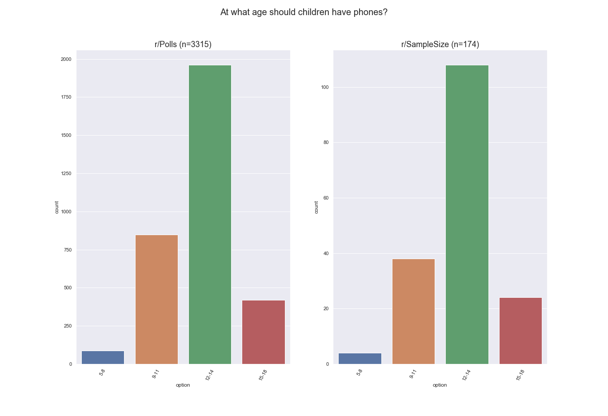
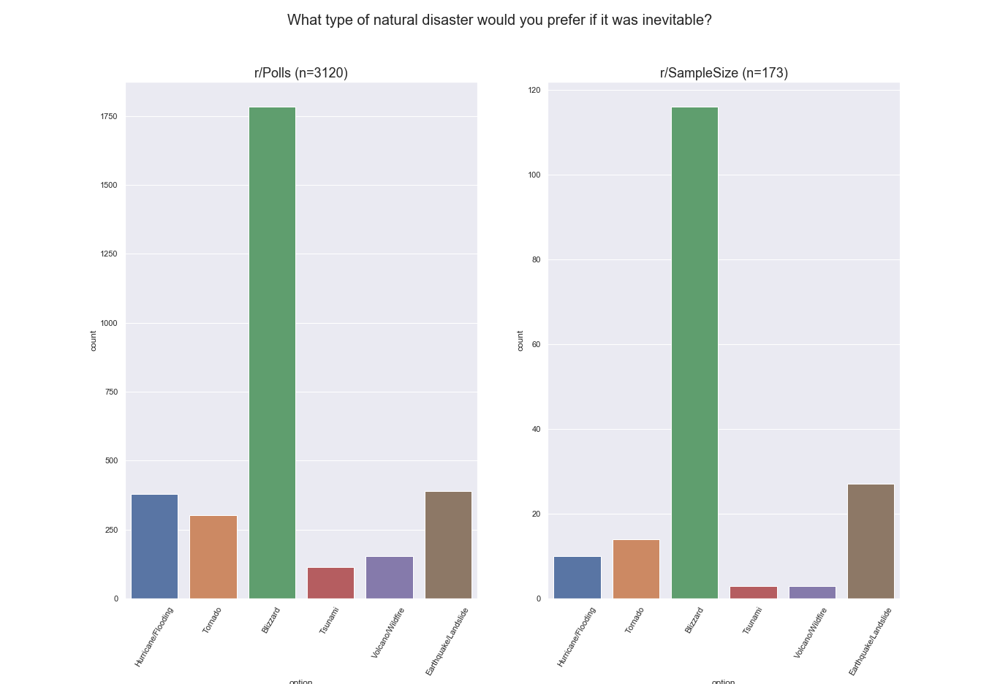
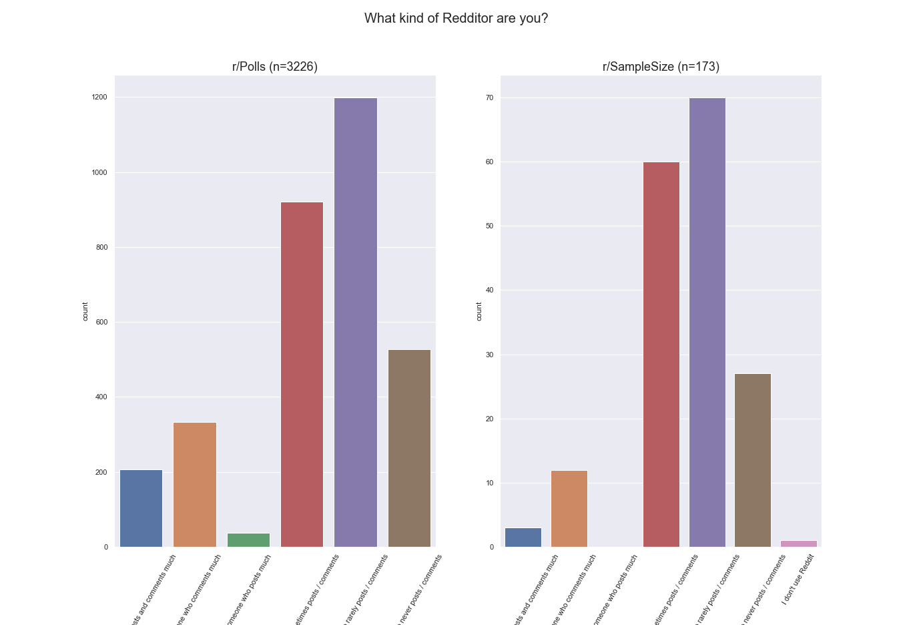
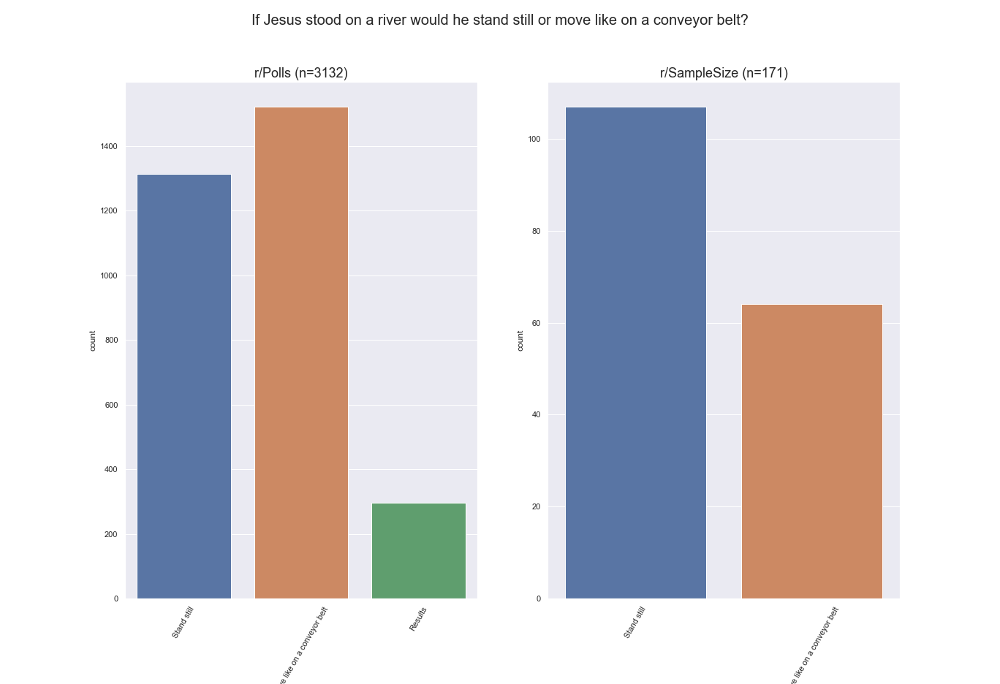
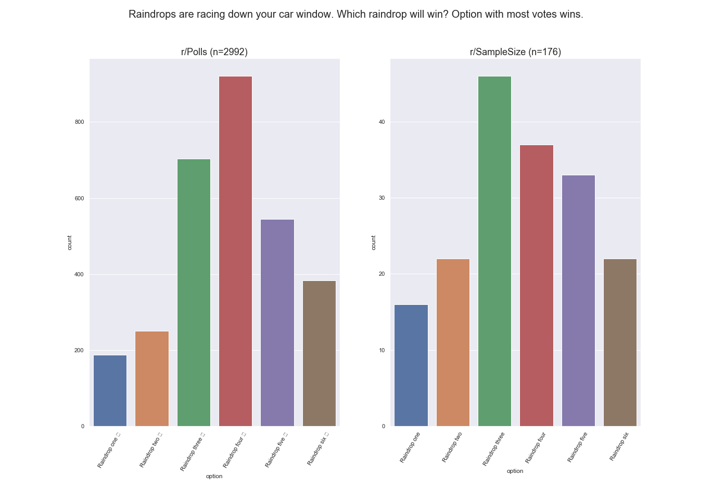
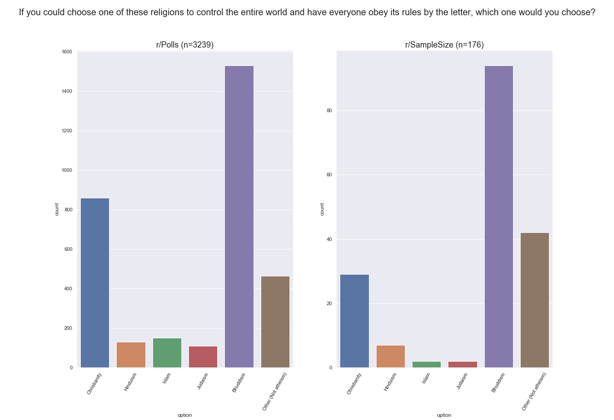
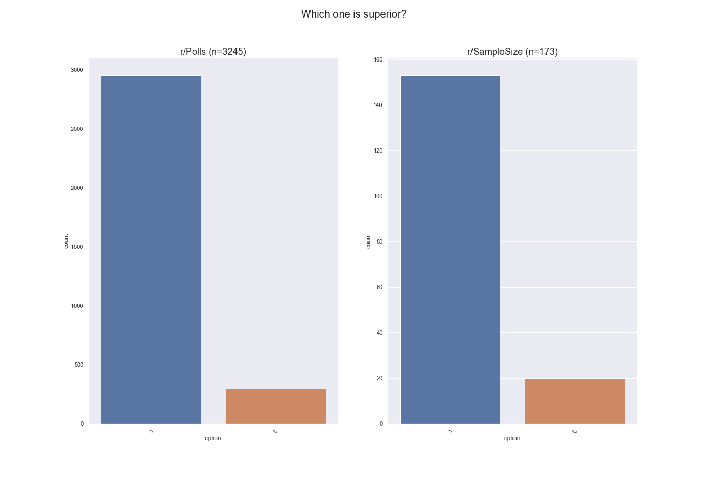

# Survey with 29 Top Voted Questions from r/Polls on r/SampleSize Results

## What color do you think the upvote button on Reddit is?

## What would you rather do?

## You live in a world where all stereotypes are true, where do you want to live.

## When do you get naked when you're about to take a shower

## (If you had to choose between these options only) I would rather live in a World dominated by...

## Would you rather:

## On a scale of 1-6 (1 being low and 6 being high), how much do you hate disorganization in polls?

## I have an argument with a friend - Does water have a taste?

## What's the real Football?

## At what age should children have phones?

## Would you eat lab-grown meat if it becomes mainstream?

## What type of natural disaster would you prefer if it was inevitable?

## What kind of Redditor are you?

## Do you like winter or summer more?

## Would you rather quarantine for 2 straight months and covid goes away or continue to live a normal life and hope it goes away

## How long do you spend in the shower on average?

## If Jesus stood on a river would he stand still or move like on a conveyor belt?

## With which statement do you most agree?

## Raindrops are racing down your car window. Which raindrop will win? Option with most votes wins.

## If you could choose one of these religions to control the entire world and have everyone obey its rules by the letter, which one would you choose?

## Tea or Coffee, which is better?

## Are people who only play mobile games gamers?

## Which of these conditions is worse in your opinion?

## Which one is superior?

## Which one do you use?

## Who was your first kiss with

## Would you rather only hear

## How do you orient your phone in your pocket?

## NEW or OLD reddit?

